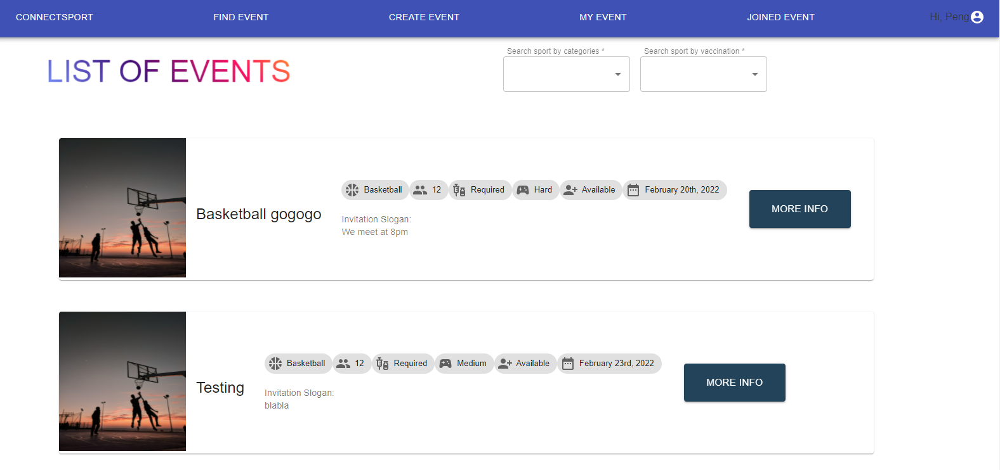
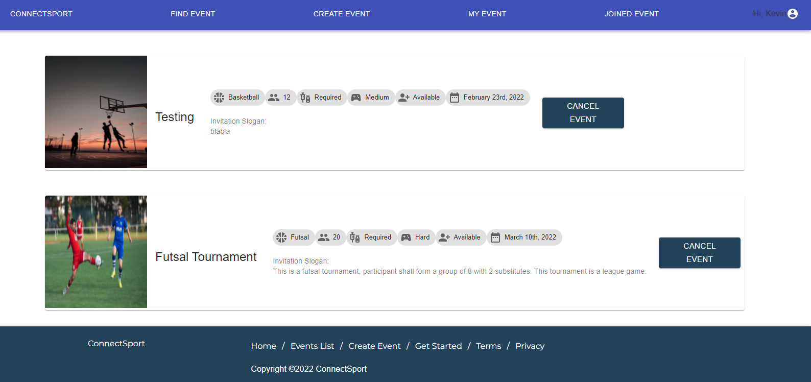

# GA Project 4 - MERN Stack

## Sport Event Hosting Web Application

**Website: [ConnectSport](https://connect-sport.herokuapp.com/)**

**Server: [ConnectSport-Server](https://connect-sport-server.herokuapp.com/)**

**Team members:**

- [Peng Kien Wei](https://github.com/kienwei96)

## Description

**ConnectSport** provides user a platform to:

- hosting sport events
- join sport events hosted by others
- view user profile

## Preview

Landing Page

Sign Up Page

Setup Profile Page

Profile Page

Host Event Page

Find Event Page

Joined Event Page

My Event Page

## Database/Storage

- **MongoDB**, a NoSQL databased used for high volume data storage

## Technologies

### Frontend

- **axios**, a promised-based HTTP client for node.js and the browser.
- **react**, a Javascript library for building user interfaces.
- **material-ui**, a library that allows us to import and use different components to create a userinterface in React Applications.
- **formik**, open source library for React, used as form helper for validation.
- **react-moment**, a react component for the moment date library.

### Backend

The backend files can be found in this [repository](https://github.com/kienwei96/GA-Project4-BackEnd)

- **bcrypt** is used to hash and store passwords in database.
- **cors** provides a Connect/Express middleware that can be used to enable CORS with various options.
- **express-jwt** provides Express middleware for validating JWTs (JSON Web Tokens) through the jsonwebtoken module.
- **jsonwebtoken** is a compact, URL-safe means of representing claims to be transferred between two parties.
- **jwt-decode** is a small browser library that helps decoding the encoded JWTs token.
- **mongoose** provides a straight-forward, schema-based solution to model the application data. It includes built-in type casting, validation, query building, business logic hooks and more, out of the box.
- **validator** is a library of string validators and sanitizers.

## Objective/Minimum Viable Product (MVP)

A working full-stack application using MERN (MongoDB, Express, React and Node.js) and CRUD (Create, Read, Update and Delete) that adheres to MVC (Models, Views, and Controllers) file structure.

- Authentication and authorization implemented using JWT and headers
- User able to setup and edit their profile.
- User able to create and delete sport events.
- User able to join and un-join hosted sport events.
- User able to view other user profile.
- User able to search sport events by filter bar (etc, by vaccination requirement or sport categories)

## General Approach taken

- Brainstorm for project idea, roadmap and list out the MVP.
- Started by set up a basic MVC structure with basic CRUD route.
- Working part by part as per MVP's list, at both Front-end and Backend, as well as testing
- Break down a function into a very simple function (i.e. logging out a string on the console) and incrementally build towards the main function.
- Host the frontend and backend to heroku.

## Unsolved Problems

- UI need to be improved

## Stretch Goals

- Chat feature that would allow users to communicate among the events
- To add social login function (etc, google login)
